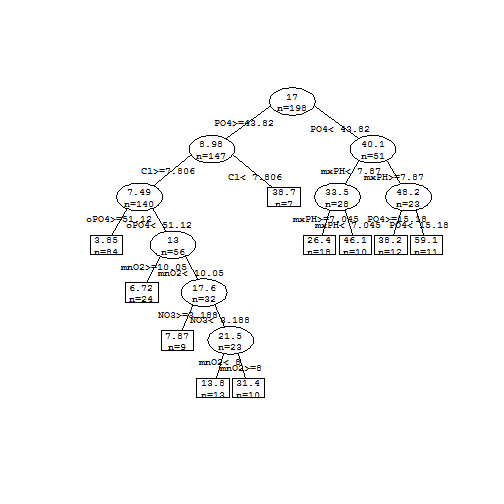
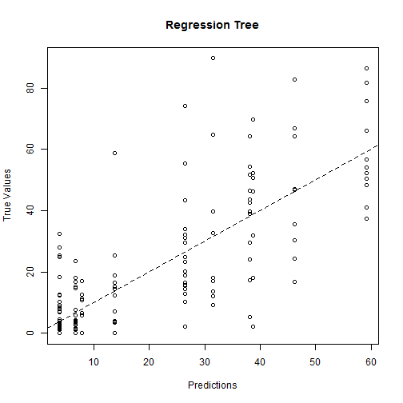
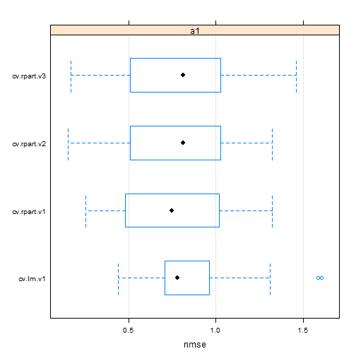

数据挖掘的基本方法
========================================================

这部分内容将主要介绍一些数据挖掘的基础方法：**数据预处理、探索性数据分析、预测模型**等。为了研究的方便，我们以一套实际的数据集为例进行具体的分析。数据描述及下载见[linked phrase](http://www.dcc.fc.up.pt/~ltorgo/DataMiningWithR/datasets2.html)。

**Preparation for running, Loading the Data into R:**


```r
library(DMwR)
```

```
## Loading required package: lattice
## Loading required package: grid
## KernSmooth 2.23 loaded
## Copyright M. P. Wand 1997-2009
```

```r
data(algae)
```

*setwd* 设置工作目录，原数据导入后以“data.frame”的形式存在，其中*col.names* 为原数据集的每一列添加了变量名称，而对于数据集中的未知值“XXXXXXX”则以“NA”进行标识。此外，R还有一些其它的方法可以读取文本格式的数据。

**Data Visualization and Summarization：**


```r
summary(algae)
```

```
##     season       size       speed         mxPH           mnO2      
##  autumn:40   large :45   high  :84   Min.   :5.60   Min.   : 1.50  
##  spring:53   medium:84   low   :33   1st Qu.:7.70   1st Qu.: 7.72  
##  summer:45   small :71   medium:83   Median :8.06   Median : 9.80  
##  winter:62                           Mean   :8.01   Mean   : 9.12  
##                                      3rd Qu.:8.40   3rd Qu.:10.80  
##                                      Max.   :9.70   Max.   :13.40  
##                                      NA's   :1      NA's   :2      
##        Cl             NO3             NH4             oPO4      
##  Min.   :  0.2   Min.   : 0.05   Min.   :    5   Min.   :  1.0  
##  1st Qu.: 11.0   1st Qu.: 1.30   1st Qu.:   38   1st Qu.: 15.7  
##  Median : 32.7   Median : 2.67   Median :  103   Median : 40.1  
##  Mean   : 43.6   Mean   : 3.28   Mean   :  501   Mean   : 73.6  
##  3rd Qu.: 57.8   3rd Qu.: 4.45   3rd Qu.:  227   3rd Qu.: 99.3  
##  Max.   :391.5   Max.   :45.65   Max.   :24064   Max.   :564.6  
##  NA's   :10      NA's   :2       NA's   :2       NA's   :2      
##       PO4             Chla              a1              a2       
##  Min.   :  1.0   Min.   :  0.20   Min.   : 0.00   Min.   : 0.00  
##  1st Qu.: 41.4   1st Qu.:  2.00   1st Qu.: 1.50   1st Qu.: 0.00  
##  Median :103.3   Median :  5.47   Median : 6.95   Median : 3.00  
##  Mean   :137.9   Mean   : 13.97   Mean   :16.92   Mean   : 7.46  
##  3rd Qu.:213.8   3rd Qu.: 18.31   3rd Qu.:24.80   3rd Qu.:11.38  
##  Max.   :771.6   Max.   :110.46   Max.   :89.80   Max.   :72.60  
##  NA's   :2       NA's   :12                                      
##        a3              a4              a5              a6       
##  Min.   : 0.00   Min.   : 0.00   Min.   : 0.00   Min.   : 0.00  
##  1st Qu.: 0.00   1st Qu.: 0.00   1st Qu.: 0.00   1st Qu.: 0.00  
##  Median : 1.55   Median : 0.00   Median : 1.90   Median : 0.00  
##  Mean   : 4.31   Mean   : 1.99   Mean   : 5.06   Mean   : 5.96  
##  3rd Qu.: 4.92   3rd Qu.: 2.40   3rd Qu.: 7.50   3rd Qu.: 6.92  
##  Max.   :42.80   Max.   :44.60   Max.   :44.40   Max.   :77.60  
##                                                                 
##        a7      
##  Min.   : 0.0  
##  1st Qu.: 0.0  
##  Median : 1.0  
##  Mean   : 2.5  
##  3rd Qu.: 2.4  
##  Max.   :31.6  
## 
```


*summary* 函数可以帮助我们得到数据集各个变量的一些基本统计特征：对于名义变量给出频数分布，而对于顺序变量则给出均值、中位数、百分数及极值等。这些统计特征能够让我们对于变量的分布有一个初步的了解，比如，我们可以观察到冬季收集的样本比秋季收集的多，变量oPO4的均值大于中位数，可能会呈现右偏分布，而这些信息都能用图形更好地展现出来。

**Data inspection by graphes:**
- **Histograms**


```r
hist(algae$mxPH, prob = T, main = "Histogram of maximum pH value", xlab = "mxPH", 
    ylab = "Density", ylim = 0:1)
lines(density(algae$mxPH, na.rm = T))
rug(jitter(algae$mxPH))
```

 


*hist* 函数设定参数*prob=T* 得到变量mxPH的概率直方图，再用*line* 函数对直方图进行平滑，可以看出mxPH的取值近似呈正态分布。为了进一步查看数据的真实分布情况，用*rug* 将mxPH的实际值添加到图中（以竖杠标识）。观察得到两个小于6的样本数据远离其它整体数据，这些数据可能存在一些问题，提示我们在后续分析中需要注意。

- **Boxplots**


```r
boxplot(algae$oPO4, boxew = 0.15, ylab = "Orthophosphate(oPO4)")
rug(jitter(algae$oPO4), side = 2)
abline(h = mean(algae$oPO4, na.rm = T), lty = 2, col = "red")
```

 


*boxplot* 做变量oPO4的箱形图，为了进一步分析数据的分布情况，将变量oPO4的数据值添加到数据图中，同时用*abline* 在箱形图中添加关于oPO4均值的以红色标记的水平虚线。均值线位于中位线的上方，结合上边缘线、上四分位线、中位线、下四分位线及下边缘线之间的距离，可以看出大部分样本的oPO4值是偏低的，而有一些观察值比较高，拉高了整体的水平，使得整体呈现右偏分布。而这些oPO4值异常高的样本可能是异常事件。
> 有些时候需要研究一个变量的分布对另外一个变量的依赖性，可以通过条件图形进行展示，R的图形包*lattice* 提供了很多画图高级工具。

- **Conditioned Boxplots**


```r
library(lattice)
bwplot(mxPH ~ size, data = algae, xlab = "River Size", ylab = " maximum pH value ")
```

 


*bwplot* 按size的不同将样本分成不同类别，再分别对样本的mxPH 做箱形图。经过比较分析可以发现来自较大河流的样本的mxPH值相对更高一些。这种条件图形并非仅限于名义变量或者单个条件因子，具体如下：


```r
library(Hmisc)
```

```
## Error: there is no package called 'Hmisc'
```

```r
minO2 <- equal.count(na.omit(algae$mnO2), number = 4, overlap = 1/5)
stripplot(season ~ mxPH | minO2, data = algae[!is.na(algae$mnO2), ])
```

 


首先对连续变量进行分解，*equal.count* 将变量mnO2平均分成4组，组与组之间有1/5的重叠，数据中的缺失值用*na.omit* 函数去掉。再对每个组内样本展示mxPH值在不同季节的分布情况，缺失值需要去除。按照左下方、右下方、左上方、右上方的顺序，不同区间的样本的mnO2值依次增加。可以观察季节与mnO2两个因素对mxPH的影响：来自autumn的样本的mnO2偏高，而mxPH在不同季节的分布状况未受mnO2的影响，mxPH在不同季节的变化也不大，说明这两个因素可能与mxPH无关。


**Outliers identification**


```r
plot(algae$mxPH, xlab = "maximum pH value")
abline(h = mean(algae$mxPH, na.rm = T), lty = 1)
abline(h = mean(algae$mxPH, na.rm = T) + sd(algae$mxPH, na.rm = T), lty = 2)
abline(h = median(algae$mxPH, na.rm = T), lty = 3)
clicked.lines <- identify(algae$mxPH)
```

 

```r
# algae[clicked.lines,]
```


*plot* 函数做变量mxPH的散点图，*abline* 函数分别以观测值的均值、均值+标准差、中位数作水平线，对整体数据进行划分。数用鼠标点击图中的任意点，*identify* 函数能够使R记录这个数据点的位置并保存到变量clicked.lines中，最后输出数据点的全部信息，这提供了一种交互式的寻找异常点的方法。

**Strategies for Unknown values**

-*Removing the observations with unknown values* 
```
algae <- na.omit(algae)
```

-*Filling in the unknowns with the most frequent val-ues* 

```
algae[48,’mxPH’] <- mean(algae$mxPH,na.rm=T)
```
第48个样本algae[48,]的mxPH变量值是空白的，可以用mxPH在其余样本中的均值代替。此外，还有一些其它的处理方式，如下：

-*Filling in the unknown values by exploring correlations*
-*Filling in the unknown values by exploring similari-ties between cases*

**Obtaining prediction models** 
回归树模型预测
--------------------------------------------------------

```r
library(rpart)  #加载rpart添加包，含有回归树模型的实现
library(DMwR)  #加载DMwR包，里面含有数据data
data(algae)
algae <- algae[-manyNAs(algae), ]
rt.a1 <- rpart(a1 ~ ., data = algae[, 1:12])  #rpart函数用于获取回归树(Regression Tree)模型
rt.a1
```

```
## n= 198 
## 
## node), split, n, deviance, yval
##       * denotes terminal node
## 
##  1) root 198 90400.0 17.000  
##    2) PO4>=43.82 147 31280.0  8.980  
##      4) Cl>=7.806 140 21620.0  7.493  
##        8) oPO4>=51.12 84  3441.0  3.846 *
##        9) oPO4< 51.12 56 15390.0 12.960  
##         18) mnO2>=10.05 24  1249.0  6.717 *
##         19) mnO2< 10.05 32 12500.0 17.650  
##           38) NO3>=3.188 9   257.1  7.867 *
##           39) NO3< 3.188 23 11050.0 21.470  
##             78) mnO2< 8 13  2920.0 13.810 *
##             79) mnO2>=8 10  6371.0 31.440 *
##      5) Cl< 7.806 7  3158.0 38.710 *
##    3) PO4< 43.82 51 22440.0 40.100  
##      6) mxPH< 7.87 28 11450.0 33.450  
##       12) mxPH>=7.045 18  5146.0 26.390 *
##       13) mxPH< 7.045 10  3798.0 46.150 *
##      7) mxPH>=7.87 23  8241.0 48.200  
##       14) PO4>=15.18 12  3048.0 38.180 *
##       15) PO4< 15.18 11  2674.0 59.140 *
```

上面数据的每一行分别代表(节点编号，节点分支条件，在这个节点上的样本数量，相对平均值的偏差，海藻a1的出现频率)
```
For example,
2) PO4>=43.818 147 31279.120  8.979592
节点编号为2；
在root节点上PO4>=43.818的就到节点2这边；
节点2含有147个水样；
海藻a1在这个条件(PO4>=43.8)的相对平均值偏差为31279.120；
海藻a1在这个条件下出现的平均频率是7.49

如果我们想建立一个回归树来预测某个水样的频率，只要从根结点开始根据对该水样检验的结果，追踪某个分支，直到叶子节点。叶结点目标变量的平均值就是树的预测值,如下图所示
```


```r
prettyTree(rt.a1)  #得到回归树的图形表示
```

 


```
上面使用rpart函数构造数，在构建树的过程中，当给定条件满足时构建过程就停止。如下列的三个条件：
1) 偏差的减少小于某一个给定的界限值
2) 当结点中的样本数量小于某个给定界限时
3) 当树的深度大于一个给定的界限值
这三个条件分别由rpart函数的三个参数来确定(cp,minsplit,maxdepth)，默认值分别是0.01，20和30
```

模型的评价
-------------------------------------

一种度量的方法就是用平均绝对误差(MAE)
  * 第一步，获取需要评价模型预测性能的预测值。这一步用predict()函数预测   

```r
rt.predictions.a1 <- predict(rt.a1, algae)
```

  * 第二步，计算其平均绝对误差


```r
(mae.a1.rt <- mean(abs(rt.predictions.a1 - algae[, "a1"])))
```

```
## [1] 8.481
```


但是有了这个值后，还是不知道怎么知道什么得分比较好，什么得分比较差。所以我们这里需要一个比值。   
就是标准化后的平均绝对误差(NMSE)。   
通常采用目标变量的平均值来作为基准模型:

```r
(nmse.a1.rt <- mean((rt.predictions.a1 - algae[, "a1"])^2)/mean((mean(algae[, 
    "a1"]) - algae[, "a1"])^2))
```

```
## [1] 0.3546
```

```r
# NMSE是一个比值，其取值范文通常为0~1。如果模型表现优于这个简单模型的基准预测。则
# NMSE会明显小于1，就是说这个值越小模型越好。大于1的话说明比平均值模型还差
```


可视化查看模型的预测值
-----------------------------------   
绘制误差的散点图   


```r
plot(rt.predictions.a1, algae[, "a1"], main = "Regression Tree", xlab = "Predictions", 
    ylab = "True Values")
# abline函数化一条y=x的虚线
abline(0, 1, lty = 2)
```

 

```r
# 虚线是一条穿过零点y=x的直线，如果所有的预测都正确，所有的圈都应该在这条虚线上。
# 表示true value = predicted value.
```


Cross Validation 选择合适的模型
------------------------------------------

因为我们之前的预测都是在训练集上进行的，这样得到的模型有可能会过渡拟合，因此我们需要获得模型在位置数据上预测性能的更加可靠的估计。   
首先获取k个同样大小的随机训练数据子集。对于每一个子集，用除去它之外的其余k-1个子集建立模型，用第k个子集来评估这个模型，最后存储模型性能指标。   
```
比较常用的k值是10
并且有时候我们甚至可以跑这个k-fold cross validation很多次从而获取更加可靠的预测
这里首先建立两个模型函数
```


```r
cv.rpart <- function(form, train, test, ...) {
    m <- rpartXse(form, train, ...)  # 得到回归树模型
    p <- predict(m, test)  # 对这个模型在测试集上进行预测
    mse <- mean((p - resp(form, test))^2)  # 利用mse(均方误差)作为误差度量
    c(nmse = mse/mean((mean(resp(form, train)) - resp(form, test))^2))
}

cv.lm <- function(form, train, test, ...) {
    m <- lm(form, train, ...)  # 线性回归模型获取
    p <- predict(m, test)  # 模型在测试集上预测
    mse <- mean((p - resp(form, test))^2)  # 同样使用mse作为衡量误差的指标
    c(nmse = mse/mean((mean(resp(form, train)) - resp(form, test))^2))
}
```

在R中有提供experimentalComparison的函数来让我们进行cross validation和不同模型之间的比较，如下代码所示   

```r
# 函数的第一个参数表示需要用到的dataset
# 第二个参数是一个向量，向量中的每个变量就是我们的模型
# variant的作用就是产生我们的模型变量, se的值表示产生三种不同的回归树模型
# 最后一个参数是设置要跑多少遍cross-validation,这里是3次，然后每次分10份，分的时候randomly分，种子是1234
res <- experimentalComparison(c(dataset(a1 ~ ., algae[, 1:12], "a1")), c(variants("cv.lm"), 
    variants("cv.rpart", se = c(0, 0.5, 1))), cvSettings(3, 10, 1234))
```

```
## 
## 
## #####  CROSS VALIDATION  EXPERIMENTAL COMPARISON #####
## 
## ** DATASET :: a1
## 
## ++ LEARNER :: cv.lm  variant ->  cv.lm.v1 
## 
##  3 x 10 - Fold Cross Validation run with seed =  1234 
## Repetition  1 
## Fold:  1  2  3  4  5  6  7  8  9  10
## Repetition  2 
## Fold:  1  2  3  4  5  6  7  8  9  10
## Repetition  3 
## Fold:  1  2  3  4  5  6  7  8  9  10
## 
## 
## ++ LEARNER :: cv.rpart  variant ->  cv.rpart.v1 
## 
##  3 x 10 - Fold Cross Validation run with seed =  1234 
## Repetition  1 
## Fold:  1  2  3  4  5  6  7  8  9  10
## Repetition  2 
## Fold:  1  2  3  4  5  6  7  8  9  10
## Repetition  3 
## Fold:  1  2  3  4  5  6  7  8  9  10
## 
## 
## ++ LEARNER :: cv.rpart  variant ->  cv.rpart.v2 
## 
##  3 x 10 - Fold Cross Validation run with seed =  1234 
## Repetition  1 
## Fold:  1  2  3  4  5  6  7  8  9  10
## Repetition  2 
## Fold:  1  2  3  4  5  6  7  8  9  10
## Repetition  3 
## Fold:  1  2  3  4  5  6  7  8  9  10
## 
## 
## ++ LEARNER :: cv.rpart  variant ->  cv.rpart.v3 
## 
##  3 x 10 - Fold Cross Validation run with seed =  1234 
## Repetition  1 
## Fold:  1  2  3  4  5  6  7  8  9  10
## Repetition  2 
## Fold:  1  2  3  4  5  6  7  8  9  10
## Repetition  3 
## Fold:  1  2  3  4  5  6  7  8  9  10
```

然后我们对结果进行一个summary,这样就可以看到nmse的值。

```r
summary(res)
```

```
## 
## == Summary of a  Cross Validation  Experiment ==
## 
##  3 x 10 - Fold Cross Validation run with seed =  1234 
## 
## * Data sets ::  a1
## * Learners  ::  cv.lm.v1, cv.rpart.v1, cv.rpart.v2, cv.rpart.v3
## 
## * Summary of Experiment Results:
## 
## 
## -> Datataset:  a1 
## 
## 	*Learner: cv.lm.v1 
##           nmse
## avg     0.8676
## std     0.2770
## min     0.4421
## max     1.6051
## invalid 0.0000
## 
## 	*Learner: cv.rpart.v1 
##           nmse
## avg     0.7617
## std     0.3019
## min     0.2550
## max     1.3212
## invalid 0.0000
## 
## 	*Learner: cv.rpart.v2 
##           nmse
## avg     0.7888
## std     0.3195
## min     0.1529
## max     1.3212
## invalid 0.0000
## 
## 	*Learner: cv.rpart.v3 
##           nmse
## avg     0.7806
## std     0.3393
## min     0.1701
## max     1.4599
## invalid 0.0000
```

更直观的我们可以画出图作为可视化结果。

```r
plot(res)
```

 


