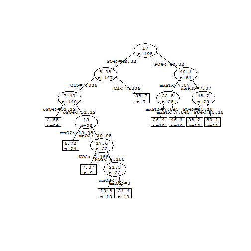

Project Introduction:预测海藻生长
========================================================

这个项目通过河流环境数据预测一些有害海藻的出现频率，让大家对数据挖掘有一定的认识。   
作为第一个case,我们选用的数据量比较少，通过探索这个小问题去了解数据挖掘。  
这个Project主要包含以下3个部分    

1. 分析用什么类型的模型做这个预测问题  
2. 如何评价我们选用的模型   
3. 使用模型对海藻的生长进行预测   


问题描述和目标
----------------------------------
1. 由于大量的有海藻会在河流中构成严重的生态问题和影响水质量，所以能够监测和预测这些有害海藻的生长非常重要。   
2. 另外一个目标就是通过这个项目可以更好的理解影响有害海藻生长的因素。

研究思路
---------------------
数据可以看到是一些环境数据和七种有害海藻在当前环境下的出现频率。我们的目标就是通过那些环境数据去预测每一种有害海藻的出现频率。我们会采取线性模型和回归树模型两种模型去做预测。最后通过测试集去评价两个模型的好坏，到底哪一个预测得更准确。

结果
------------------------
我们分别运用两种模型对七种的有害海藻进行预测。利用多种评价指标去评测线性模型和回归树模型证明在这次的项目中回归树模型效果比线性模型更好。

实验过程
--------------

### 1. 数据加载


```r
library(DMwR)  #加载DMwR包，里面含有海藻数据algae data
```

```
## Loading required package: lattice
## Loading required package: grid
## KernSmooth 2.23 loaded
## Copyright M. P. Wand 1997-2009
```

```r
head(algae)  #打印algae数据
```

```
##   season  size  speed mxPH mnO2    Cl    NO3    NH4   oPO4    PO4 Chla
## 1 winter small medium 8.00  9.8 60.80  6.238 578.00 105.00 170.00 50.0
## 2 spring small medium 8.35  8.0 57.75  1.288 370.00 428.75 558.75  1.3
## 3 autumn small medium 8.10 11.4 40.02  5.330 346.67 125.67 187.06 15.6
## 4 spring small medium 8.07  4.8 77.36  2.302  98.18  61.18 138.70  1.4
## 5 autumn small medium 8.06  9.0 55.35 10.416 233.70  58.22  97.58 10.5
## 6 winter small   high 8.25 13.1 65.75  9.248 430.00  18.25  56.67 28.4
##     a1   a2   a3  a4   a5   a6  a7
## 1  0.0  0.0  0.0 0.0 34.2  8.3 0.0
## 2  1.4  7.6  4.8 1.9  6.7  0.0 2.1
## 3  3.3 53.6  1.9 0.0  0.0  0.0 9.7
## 4  3.1 41.0 18.9 0.0  1.4  0.0 1.4
## 5  9.2  2.9  7.5 0.0  7.5  4.1 1.0
## 6 15.1 14.6  1.4 0.0 22.5 12.6 2.9
```

### 2. 数据描述和分析   

**数据源**： 数据是来自COIL 1999 Competition的数据，是Multivariate的类型。数据的拥有者是ERUDIT的一个组织，在1999年捐出的。   
_Note_:数据的详细信息由这个[link](http://archive.ics.uci.edu/ml/machine-learning-databases/coil-mld/coil.data.html)给出。 

Algae数据集中包含两类dataset.  

* 第一类含有200个水样主要是用来作训练(Training)的.每一个水样中含有11种的feature，剩余的a1~a7表示7种海藻的出现频率。   
     
  |Variable | Type         | Variable Description                                     |    
  |:------- |:------------:| -------------------------------------------------------- |    
  |season   | nominal      | Season of the year when the water samples were collected |    
  |size     | nominal      | Size of the river                                        |
  |speed    | nominal      | speed of the river                                       |   
  |mxPH     | numbers      | Maximum PH value                                         |   
  |mnO2     | numbers      | Minimum value of oxygen                                  |   
  |cl       | numbers      | Mean value of chloride                                   |   
  |NO3      | numbers      | Mean value of nitrates                                   |   
  |NH4      | numbers      | Mean value of ammonium                                   |   
  |oPO4     | numbers      | Mean of prthophosphate                                   |   
  |PO4      | numbers      | Mean of total phosphate                                  |   
  |Chla     | numbers      | Mean of chlorophyll                                      |   
   
* 第二类的dataset包含140个的额外水样，用来做测试集。这140个水样中和前面的200个有同样的信息，但是并不包含7种有害海藻的出现频率。    
* 我们的工作就是利用这11种feature和七种海藻的频率数据去获得一个模型，使得这个模型可以让我们使用已知11种feature的数据去预测七种海藻的出现频率。要得到的这个模型可能会提供一些指示给我们说哪些feature对海藻出现频率影响高，哪些feature对结果影响低，就是相当于对不同的variable有一种权重的区分。  
  ![alt text][id]   
  [id]: figure/Model-Training.png "Model Training"   
  
* 在这个地方你可以用一些histogram, QQ graph, box graph等一些可视化图形函数进行对每一个feature在数据中的distribution进行分析，这也算是偷看数据的一种方式。   

### 3. 数据清理
因为可能有一些数据是没有填的，就是null值，如果太多这种null值的数据我们就要清楚掉。   
我们这里采用的方法就是如果数据中的一行有很多行null值，这一行我们就不要，默认是80%。   
然后对其他的数据利用最接近的10个数据的中位数去填补。

```r
algae <- algae[-manyNAs(algae), ]
clean.algae <- knnImputation(algae, k = 10)
```


### 4. 获取模型   
* __模型的选择__    
  在这里我们可以看到输出output的七种有害海藻都是一些频率值，频率值越高，说明出现的越频繁，这个结论是显然的。所以我们可以把这个project的问题 看成是一个分数预测的问题，就是把海藻出现频率，从概念上当做是machine learning中的score,我们的任务就是要去预测这个score. 所以我们现在遇到的是一个regression problem，回归问题。我们需要一个regression model帮助我们预测海藻的频率(target variable). 在本文章中我们使用了两种回归模型进行比较，一种是比较常用的多元线性回归模型，另外一种是回归树模型。      
  * __多元线性回归模型__   
    (1) 多元线性回归简单介绍   
    主要就是对每一个feature训练出来一个weight，然后用这些weights应用到测试集的feature中，从而得到输出。例如   
    -----------------------------Example----------------------------------------     
    __Feature__: \( f1\,\, f2\,\, f3\,\, f4 \)    
    __Weights from Training__: \( w1\,\, w2\,\, w3\,\, w4 \)   
    __Output by predicton__: \( o1\,=\,w1f1+w2f2+w3f3+w4f4 \)   
    ----------------------------------------------------------------------------      
    (2) 利用R语言内置的lm函数即可以获得linear regression model线性模型   
    `a1 ~`这个是表示用除了a1以外的所有属性数据来构造模型   
    然后数据是用的1到12列数据。
    
    ```r
    lm.a1 <- lm(a1 ~ ., data = clean.algae[, 1:12])
    ```

    ---------------------------------------------
  * __回归树模型__    
  主要是获得一个regression tree去预测algae的频率，利用R语言里面的rpart函数构造模型。   
  
  ```r
  library(rpart)
  rt.a1 <- rpart(a1 ~ ., data = algae[, 1:12])
  ```


### 5. 预测及模型评价和选择

在模型的评价中，我们选择MAE(mean absolute error)作为评价的参数，从而评价线性模型和回归树模型的好坏。   
    
1. 首先我们先用模型在测试集上进行预测   
R提供一个general的function供我们做预测，显然这个函数可以帮助我们在剩下的140个water sample上去预测未知的a1~a7有害海藻的频率。   
  
  ```r
  lm.predictions.a1 <- predict(lm.a1, clean.algae)  ###线性模型预测
  rt.predictions.a1 <- predict(rt.a1, algae)  ###回归树模型预测
  ```

     
2. 模型的评价  
对模型进行评价，我们需要有一些评价的指标，对于我们这种预测的模型。 我们一般会去比较预测出来的测试集的分数和测试集真实的分数，从而去计算一些比较参数。目前主要有一下这几种参数的选取。    
    
  |Metrics | Description            |   
  |:-------|:-----------------------|   
  |mae     |mean absolute error     |   
  |mse     |mean squared error      |   
  |nmse    |normalized mean square  |   
  

  __MAE__：主要是叠加预测值和真实值之差然后再求平均。  
  $$MAE =\frac{1}{N} \sum \left | pred_{i}-real_{i} \right |$$   
  __MSE__: 主要是叠加预测值和真实值之差然后再求平均
  $$MSE =\frac{1}{N} \sum ( pred_{i}-real_{i} )^{2}$$   
  __NMSE__: 比MSE多加了一步Normalized的过程。  
  $$NMSE =\frac{1}{N} \sum\frac{( pred_{i}-real_{i} )^{2}}{\overline{pred}\times\overline{real}} $$    
  **三种指标分析**：在这三种指标中，MAE计算简单，所以获得了广泛的应用，但是MAE也有一定的局限性，因为MAE比较少只能指出预测的分数和实际分数比较接近，不能指出这个分数效果比较好。MSE对每个绝对误差首先都做了平方，对比较大的绝对误差有更重的惩罚。而NMSE在评分区间做了归一化，从而可以更合理的比较不同模型的好坏。  
2. 计算参数   
在我们这个case里面，我们比较简单的采取mae进行对我们模型的评价，使用R中提供的mean方法，我们可以计算出两种模型在测试集上的mae值。  
  
  ```r
  (mae.a1.lm <- mean(abs(lm.predictions.a1 - algae[, "a1"])))
  ```
  
  ```
  ## [1] 12.72
  ```
  
  ```r
  (mae.a1.rt <- mean(abs(rt.predictions.a1 - algae[, "a1"])))
  ```
  
  ```
  ## [1] 8.481
  ```

  
### 6. 结果  
显然，从结果中我们可以看到回归树的mae比线性模型的mae小，因此回归树模型的预测会更准确，所以回归树模型表现更好。   
然后可以用同样的方法在其他六种algae上进行预测。    

### 7. 结论   
这篇文章通过海藻生长预测，阐述了数据挖掘问题中的一些基本步骤，数据的操作问题以及一些模型的应用和评价问题。整个模型的实际意义在于利用对海藻的预测从而根据有害海藻的出现频率进行对河流的保护。

### 8. 扩展阅读   
1. 模型   
对于线性模型和回归树模型，请读者到算法页面进行学习。  
     
2. 对NA未知值的处理方法   
  * 可以直接清除掉，有NA值的行。   
  ```
  algae <- na.omit(algae)
  ```
  * 也可以填入一些常用值，如平均值和中位数等。例如   
  ```
  algae[48,"mxPH"] <- mean(algae$mxPH, na.rm = T)   
  algae[is.na(algae$Chla),"Chla"] <- median(algae$Chla, na.rm = T)  
  ```
  
3. 模型查看  
  
  ```r
  ## 因为前三种变量是因子变量，而最后summary时会出现16个变量，当R去处理这些因子变量的时候，R会创建一些辅助变量，就是对每个有k个level的因子变量，R会创建k-1一个辅助变量，这些变量的值是0或者1，1表示现在是在这个值，并且其他辅助变量的值就是0，就是说只有一个1存在，然后通过这样去做回归。
  summary(lm.a1)  ##查看线性模型   
  ```
  
  ```
  ## 
  ## Call:
  ## lm(formula = a1 ~ ., data = clean.algae[, 1:12])
  ## 
  ## Residuals:
  ##    Min     1Q Median     3Q    Max 
  ## -37.68 -11.89  -2.57   7.41  62.19 
  ## 
  ## Coefficients:
  ##              Estimate Std. Error t value Pr(>|t|)   
  ## (Intercept)  42.94206   24.01088    1.79   0.0754 . 
  ## seasonspring  3.72698    4.13774    0.90   0.3689   
  ## seasonsummer  0.74760    4.02071    0.19   0.8527   
  ## seasonwinter  3.69295    3.86539    0.96   0.3406   
  ## sizemedium    3.26373    3.80205    0.86   0.3918   
  ## sizesmall     9.68214    4.17997    2.32   0.0217 * 
  ## speedlow      3.92208    4.70631    0.83   0.4057   
  ## speedmedium   0.24676    3.24187    0.08   0.9394   
  ## mxPH         -3.58912    2.70353   -1.33   0.1860   
  ## mnO2          1.05264    0.70502    1.49   0.1372   
  ## Cl           -0.04017    0.03366   -1.19   0.2343   
  ## NO3          -1.51124    0.55134   -2.74   0.0067 **
  ## NH4           0.00163    0.00100    1.63   0.1052   
  ## oPO4         -0.00543    0.03988   -0.14   0.8918   
  ## PO4          -0.05224    0.03075   -1.70   0.0911 . 
  ## Chla         -0.08802    0.08000   -1.10   0.2727   
  ## ---
  ## Signif. codes:  0 '***' 0.001 '**' 0.01 '*' 0.05 '.' 0.1 ' ' 1
  ## 
  ## Residual standard error: 17.6 on 182 degrees of freedom
  ## Multiple R-squared:  0.373,	Adjusted R-squared:  0.321 
  ## F-statistic: 7.22 on 15 and 182 DF,  p-value: 2.44e-12
  ```
  
  ```r
  rt.a1  ##查看回归树模型
  ```
  
  ```
  ## n= 198 
  ## 
  ## node), split, n, deviance, yval
  ##       * denotes terminal node
  ## 
  ##  1) root 198 90400.0 17.000  
  ##    2) PO4>=43.82 147 31280.0  8.980  
  ##      4) Cl>=7.806 140 21620.0  7.493  
  ##        8) oPO4>=51.12 84  3441.0  3.846 *
  ##        9) oPO4< 51.12 56 15390.0 12.960  
  ##         18) mnO2>=10.05 24  1249.0  6.717 *
  ##         19) mnO2< 10.05 32 12500.0 17.650  
  ##           38) NO3>=3.188 9   257.1  7.867 *
  ##           39) NO3< 3.188 23 11050.0 21.470  
  ##             78) mnO2< 8 13  2920.0 13.810 *
  ##             79) mnO2>=8 10  6371.0 31.440 *
  ##      5) Cl< 7.806 7  3158.0 38.710 *
  ##    3) PO4< 43.82 51 22440.0 40.100  
  ##      6) mxPH< 7.87 28 11450.0 33.450  
  ##       12) mxPH>=7.045 18  5146.0 26.390 *
  ##       13) mxPH< 7.045 10  3798.0 46.150 *
  ##      7) mxPH>=7.87 23  8241.0 48.200  
  ##       14) PO4>=15.18 12  3048.0 38.180 *
  ##       15) PO4< 15.18 11  2674.0 59.140 *
  ```
  
  ```r
  prettyTree(rt.a1)  ##describt the regression tree
  ```
  
   

  
